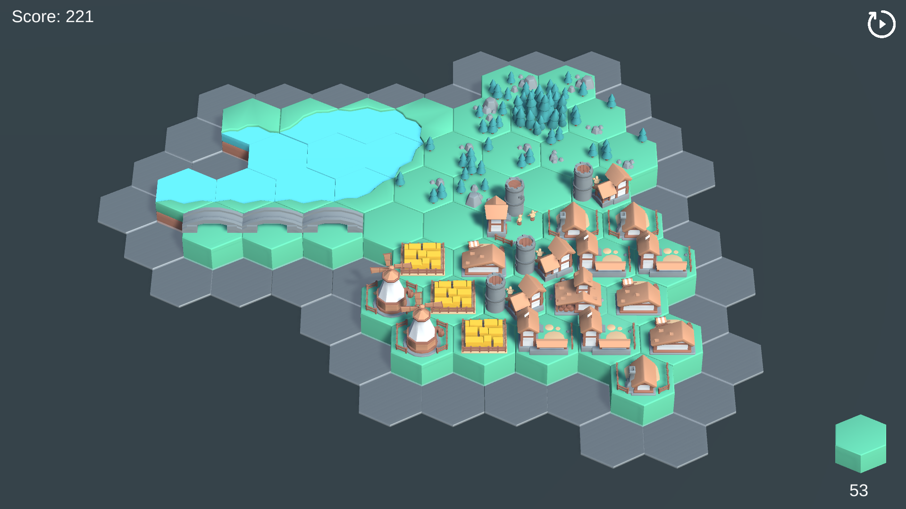

# HexagonWorldBuilder

Hexagon World Builder is a calm and soothing game where the goal is to score the most points with 100 tiles.
The player has 100 tiles he can place anywhere adjacent to another tile, however each side of a tile has its own biome, and placing water tiles next to other water tiles, or forest next to other forest tiles will score more than randomly placing the tiles.
